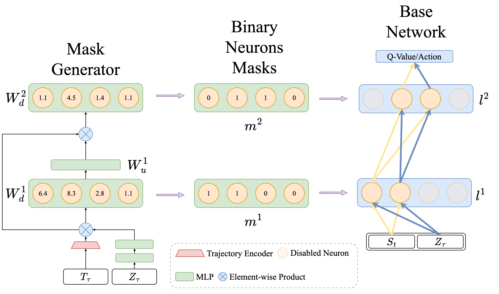
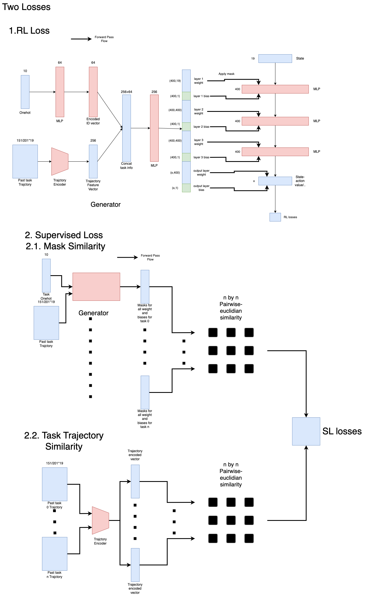

# Dynamic Sparse Training for Multi-Task Reinforcement Learning

## Overview
This project explores a novel approach to Multi-Task Reinforcement Learning (MT-RL) by incorporating Dynamic Sparse Training techniques. We propose a framework that generates dynamic masks conditioned on both state and task information to enable more effective parameter sharing across tasks.

## Key Features
- Dynamic mask generation based on both state and task information
- Structured pruning approach targeting neurons instead of individual weights
- Adaptive parameter sharing mechanism across similar tasks and states
- Integration with SAC (Soft Actor-Critic) for continuous control tasks

## Architecture
The framework consists of two main components:
1. **Mask Generator**: A neural network that generates binary masks for each weight matrix in the base network, taking state, task, and pruning ratio as inputs.
2. **MT-RL Training Loop**: A modified SAC implementation that incorporates dynamic sparse training.  


### Training Objectives
- Standard MT-RL loss for the base network
- Mask similarity optimization based on policy similarities
- Pairwise similarity computation across tasks for mask generation


## Methodology

### Framework Components

#### Mask Generator Network
- **Input**: 
  - State information
  - Task encoding (one-hot)
  - Pruning ratio parameter
- **Output**: Binary mask matrices for each layer of the base network
- **Architecture**: 
  - Compact neural network designed for structured pruning
  - Generates masks at neuron-level instead of weight-level
  - Uses state-task concatenated input to inform mask generation

#### Base MT-RL Network
- **Architecture**: Modified SAC implementation
- **Components**:
  - Multi-layer perceptron (MLP) with dynamic masking
  - Layer configurations: [400, 400] for policy networks
  - State-action value network with similar architecture
  - Trajectory encoder: 256-dimensional embedding

### Training Process

#### Main Training Loop
1. Sample tasks and collect trajectories
2. Apply dynamic masks generated based on current state-task pairs
3. Update base network using masked parameters
4. Store subset of trajectories for mask similarity training

#### Mask Optimization
- **Schedule**: Updates every k episodes
- **Process**:
  1. Generate masks for all tasks given common states
  2. Compute pairwise mask similarities
  3. Normalize similarities to [0,1] range
  4. Generate 50x50 similarity matrix for 50 tasks

#### Policy Similarity Computation
1. Sample trajectories for each task
2. Encode trajectories using VAE into latent space
3. Estimate policy distributions in latent space
4. Compute pairwise KL divergence between policy distributions
5. Generate target similarity matrix

#### Loss Functions
1. **RL Loss**: Standard SAC loss function
   ```
   L_RL = E[r_t + γ(min Q - α log π)]
   ```

2. **Mask Similarity Loss**: MSE between mask and policy similarities
   ```
   L_mask = MSE(S_mask, S_policy)
   ```
   where S_mask and S_policy are the similarity matrices

### Implementation Details

#### Structured Pruning Approach
- Operates at neuron level rather than weight level
- Pruning ratios tested: up to 90-95% parameter reduction
- Dynamic updates based on network performance

#### Training Schedule
- Mask updates: Every k=1000 episodes
- Total interactions:
  - MT10: 2M interactions per task
  - MT50: 1M interactions per task for fixed, 2M for random versions

#### Trajectory Processing
- VAE encoder dimension: 256
- Trajectory buffer size: 15k steps
- Similarity computation batch size: 50 tasks

## Results
**Important!**: Current implementation achieves performance approximately 12% lower than Soft Modularization on average, though it outperforms the baseline SAC method. Further optimizations are being explored to improve performance.

### Benchmarks
Tested on Meta-World environments:
- MT10 random
- MT50 fix
- MT50 random
- MT10 fix

### Baselines Compared
- Multi-head SAC
- Soft Modularization
- CAGrad
- Pure SAC

## Implementation Details

### Hardware Requirements
- CPU: 4-5 cores
- Memory: 32-50GB
- GPU: NVIDIA V100

### Time Requirements
- MT10 experiments: ~3 days
- MT50 experiments: ~5.5-7 days

## Advantages
1. Maintains high sample efficiency
2. Reduced parameter count per task's masked sub-network
3. Dynamic mask generation enables state-dependent parameter sharing
4. Effective feature sharing through sparse network structures

## Current Limitations
1. Performance gap compared to Soft Modularization
2. Hardware support required for optimal pruning ratio implementation
3. Computational overhead from mask generation

## Future Work
1. Optimization of mask generation architecture
2. Exploration of different pruning ratios
3. Investigation of alternative similarity metrics
4. Hardware-specific optimizations

## License
This project is licensed under the MIT License - see the [LICENSE](LICENSE.md) file for details.

## Acknowledgments
This research was conducted using the compute resources of Compute Canada, at the University of Alberta - Intelligent Robot Learning Lab (IRLL), in collaboration with Alberta Machine Intelligence Institute (Amii).
